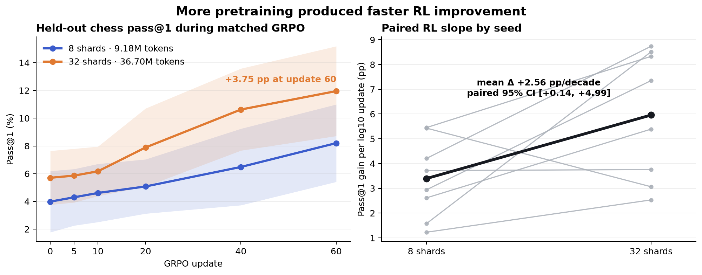
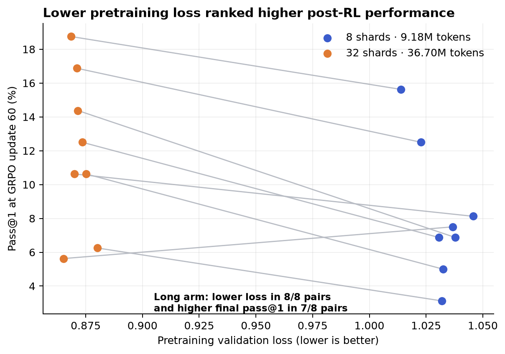

# More pretraining accelerated chess RL at 20M parameters

The central question in *Understanding Reasoning from Pretraining to Post-Training* is whether pretraining quality only gives RL a better starting point, or also changes how quickly a policy improves. The paper reports both effects. This reproduction isolates them in a bounded public chess pipeline: two nested pretraining exposures, one architecture, matched SFT and GRPO, exact puzzle rewards, and eight paired seeds.

**Result:** the selected claims aligned under the reduced setup. Moving from 9.18M to 36.70M pretraining tokens lowered mean validation loss from 1.03150 to 0.87191 and increased the mean fitted RL slope from 0.03395 to 0.05959 pass@1 per log10 update. The paired slope difference was +0.02564 (95% t interval +0.00140 to +0.04989, n=8). At GRPO update 60, mean pass@1 was 8.20% versus 11.95%, a paired +3.75 percentage-point difference (95% interval +1.40 to +6.10).

## Claims and assessments

| Claim | Paper evidence | Observed evidence | Assessment |
|---|---|---|---|
| More pretraining causes faster RL improvement at fixed size and matched post-training. | The paper's full sweep reports Pearson r=+0.84 between local RL slope and log pretraining tokens. | Mean slopes were 0.03395 (9.18M tokens) and 0.05959 (36.70M); the paired difference was +0.02564 with a 95% interval above zero. Seven of eight seed-pair slope differences were positive. | **Aligned; reproduced for the tested two-level scale.** Two levels cannot establish the paper's approximately linear multi-point law. |
| Pretraining validation loss ranks post-RL pass@1 at matched RL compute. | Across reference compute levels, the paper reports Spearman magnitude 0.93–0.99: lower loss predicts higher reward. | The long checkpoint had lower validation loss in all 8 pairs. Its aggregate pass@1 was higher at all six matched updates; it won 7/8 pairs at update 60. | **Aligned; reproduced as a two-checkpoint ordering test.** The paper's full correlation fit was not re-estimated. |

The second claim is visible seed by seed below. Every orange point moves left to lower validation loss; seven of eight also move upward at update 60.

## Implementation

The implementation is a compact reconstruction of the released protocol, informed by the paper and the later public [`pre2post-chess`](https://github.com/pavelslab-nyu/pre2post-chess) repository. It follows one code path:

1. Download nested official token shards from [`chess-pre-to-post/pretrain_v1_20b`](https://huggingface.co/datasets/chess-pre-to-post/pretrain_v1_20b), 500 Stockfish-verified traces from [`sft_v1_200m_90k`](https://huggingface.co/datasets/chess-pre-to-post/sft_v1_200m_90k), and puzzles from [`chess-rl-data-balanced`](https://huggingface.co/datasets/chess-pre-to-post/chess-rl-data-balanced).
2. Train a 20,539,904-parameter Qwen-style autoregressive transformer: 6 layers, width 512, intermediate width 1,536, four attention heads, context 256, and an 81-token move vocabulary plus three trace-control tokens.
3. Apply the same 120-step SFT recipe to both checkpoints using tokenized, verified search traces.
4. Run the same 60-update GRPO loop with group size 8, clip 0.2, KL coefficient 0.001, and binary reward for the exact ground-truth solver move.
5. Evaluate greedy pass@1 on 160 held-out puzzles at updates 0, 5, 10, 20, 40, and 60.

Puzzle construction matters. The public record's FEN precedes the environment move, so the loader first applies `first_move_uci` and only then checks the solver's `ground_truth` move. Evaluation IDs are selected by a stable SHA-256 bucket, excluded from the 1,024-puzzle RL set, and filtered against SFT positions. Puzzles are restricted to ratings 800–1,800 and a single verified solver move.

The initial 8-way DDP scouts reached an illegal-memory fault at their first NCCL collective on both Blackwell nodes. The successful design uses a CPU Gloo barrier only for shared downloads; every GPU then trains a complete independent seed. This preserves arm matching and converts each 8-GPU allocation into eight paired observations. It does change the effective per-model batch from the paper, so the result is evidence for the directional claims, not a numerical replication of the paper's curve.

## Experimental design

| Setting | Short arm | Long arm |
|---|---:|---:|
| Public pretraining shards | 8 | 32 |
| Tokens seen once per model | 9,176,672 | 36,704,319 |
| Pretraining optimizer steps | 2,240 | 8,961 |
| Independent seeds | 8 | 8 |
| SFT steps / examples available | 120 / 500 | 120 / 500 |
| GRPO updates / group size | 60 / 8 | 60 / 8 |
| RL train / held-out puzzles | 1,024 / 160 | 1,024 / 160 |

The only intended arm difference is the nested pretraining prefix. Seeds 20260720–20260727, model shape, optimizer settings, SFT examples, puzzle split, GRPO samples, and evaluation updates are matched.

## Results

| GRPO update | Short mean pass@1 | Long mean pass@1 | Difference | Long wins / ties among 8 pairs |
|---:|---:|---:|---:|---:|
| 0 | 3.98% | 5.70% | +1.72 pp | 6 / 1 |
| 5 | 4.30% | 5.86% | +1.56 pp | 6 / 1 |
| 10 | 4.61% | 6.17% | +1.56 pp | 6 / 1 |
| 20 | 5.08% | 7.89% | +2.81 pp | 6 / 0 |
| 40 | 6.48% | 10.62% | +4.14 pp | 7 / 0 |
| 60 | 8.20% | 11.95% | +3.75 pp | 7 / 0 |

The longer-pretrained arm starts higher, but its advantage also grows during RL. Relative to update 0, the short mean gains 4.22 points and the long mean gains 6.25 points. The fitted slope comparison uses updates 5–60 against log10(update), matching the paper's local log-linear framing while substituting update count for FLOPs.

Pretraining loss also cleanly orders the two exposures: all eight long seeds have lower loss than their paired short seeds. At every matched update, the checkpoint family with lower mean loss has higher mean pass@1. The final paired comparison has one reversal, which is consistent with finite evaluation noise from 160 puzzles and reinforces why the aggregate and paired interval matter.

All plotted values are in [`trajectory_summary.csv`](trajectory_summary.csv); seed-level loss, slope, endpoint, elapsed time, and source run are in [`seed_summary.csv`](seed_summary.csv). The figure generator is [`make_figures.py`](make_figures.py).

### Three-epoch SFT and a token midpoint

A prespecified robustness round increased trace SFT from 120 steps to 750 steps—1,500 example draws, or three passes over the 500 available traces—and added a nested 16-shard checkpoint. Each exposure again used the same eight paired seeds and 60 GRPO updates.

| Nested exposure | Mean pretraining loss | Mean RL slope | Mean pass@1 at update 60 |
|---:|---:|---:|---:|
| 8 shards · 9.18M tokens | 1.02863 | 0.10178 | 21.33% |
| 16 shards · 18.35M tokens | 0.94129 | 0.10681 | 21.41% |
| 32 shards · 36.70M tokens | 0.87279 | 0.13810 | 27.19% |

The three arm means preserve both orderings: more tokens correspond to lower validation loss and a steeper fitted RL trajectory. The midpoint effect is extremely small for final pass@1, however, and seed-level ordering is not monotone (only 3/8 seeds have strictly increasing slopes across all three checkpoints). In the direct 32-versus-8-shard comparison, slope is higher in 6/8 pairs and final pass@1 in 7/8, but both paired 95% intervals cross zero. This is directional robustness for the primary result, not evidence for a precise linear law.

## Evidence boundaries

This is a claim-focused scale substitution, not the paper's 36-combination sweep. The paper used roughly 200M–52B pretraining tokens, 8–11 checkpoints at each of four model sizes, 1,000–5,000 RL steps, and a larger benchmark. Here the primary test has two pretraining levels at one size; a robustness check adds only one midpoint. Both use 60 updates, 160 evaluation puzzles, truncated traces, and no pass@k or compute-frontier analysis. Consequently:

- The experiment tests **direction and ordering**, and supports both selected claims.
- The three exposure means are ordered, but they do not support a reliable estimate of linearity, the paper's +0.84 correlation, its nonlinear loss-to-reward fit, or asymptotic RL ceilings.
- The reported intervals quantify variation across eight paired training seeds, not uncertainty over datasets or architectures.

## Compute and provenance

All runs used the configured OpenResearch Kubernetes backend. The GPU model reported in terminal logs was **NVIDIA RTX PRO 6000 Blackwell Server Edition** (contract label: NVIDIA RTX PRO 6000 Blackwell). Peak concurrent allocation was **16 GPUs**: two 8-GPU arms. From the first Kubernetes baseline launch at 2026-07-20 22:10:02 UTC through the final midpoint terminal state at 22:51:56 UTC, actual elapsed campaign wall time was **0.698 hours**.

| Experiment | Exact command | Kubernetes job wall | Result branch |
|---|---|---:|---|
| Short, 8 shards × 8 seeds | `bash run.sh` | 1m35s | [`orx/formal-short-8-shards`](https://github.com/alphaXiv/understanding-reasoning-from-pretraining-to-post/tree/orx/formal-short-8-shards) |
| Long, 32 shards × 8 seeds | `bash run.sh` | 3m11s | [`orx/formal-long-32-shards`](https://github.com/alphaXiv/understanding-reasoning-from-pretraining-to-post/tree/orx/formal-long-32-shards) |
| Three-epoch short, 8 shards × 8 seeds | `bash run.sh` | 3m00s | [`orx/matched-short-exposure-8-replicas`](https://github.com/alphaXiv/understanding-reasoning-from-pretraining-to-post/tree/orx/matched-short-exposure-8-replicas) |
| Three-epoch midpoint, 16 shards × 8 seeds | `bash run.sh` | 2m13s | [`orx/matched-midpoint-exposure-8-replicas`](https://github.com/alphaXiv/understanding-reasoning-from-pretraining-to-post/tree/orx/matched-midpoint-exposure-8-replicas) |
| Three-epoch long, 32 shards × 8 seeds | `bash run.sh` | 6m29s | [`orx/matched-long-exposure-8-replicas`](https://github.com/alphaXiv/understanding-reasoning-from-pretraining-to-post/tree/orx/matched-long-exposure-8-replicas) |

The implementation, frozen configs, measurements, and notebook are published on `main`. The notebook opens with these completed measurements and does not require readers to rerun training: [open it directly in Molab](https://molab.marimo.io/github/alphaXiv/understanding-reasoning-from-pretraining-to-post/blob/main/notebooks/pretraining_to_rl.py).

## Assessment

Both selected claims are reproduced under the bounded setup: four times more nested pretraining data produced a statistically positive paired increase in RL slope, and the lower-loss checkpoint family ranked higher in aggregate post-RL pass@1 at every matched update. The three-epoch 8/16/32-shard round preserves both arm-mean orderings while exposing substantial seed noise and an almost-flat 8-to-16-shard endpoint. The main divergence from the paper is scope, not direction. A full-scale reproduction would restore the paper's checkpoint ladder, model-size sweep, long RL schedules, full puzzle benchmark, and FLOP-based fits.
